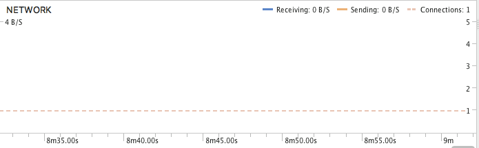

Consumo de rede
=============

Android Profiler
-----------------

A realização dos testes de uso de rede foi realizado através do Android Profiler. Ele retorna em tempo real as informações necessárias.
Os testes que foram feitos mostram o usuário e suas possíveis ações para consumir rede. Os testes feitos foram:

- **Situação 1:** Iniciar o aplicativo;
- **Situação 2:** Fazer o download do podcast;
- **Situação 3:** Após o download do podcast ter finalizado;

Nessa situação o aplicativo foi iniciado e nenhum consumo de rede foi utilizado.

Essa situação é após o download do podcast ter finalizado também não tendo nenhum consumo de rede.

Essa situação foi no momento em que o download do podcast é iniciado, consequente como pode ser visto, tendo um consumo de rede significativo. 

Essa situação foi apenas para ilustrar o momento do pico do consumo da rede durante o download do podcast.

