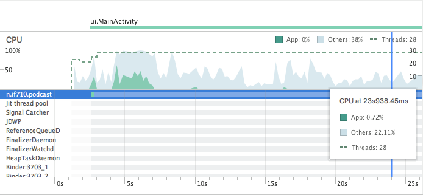
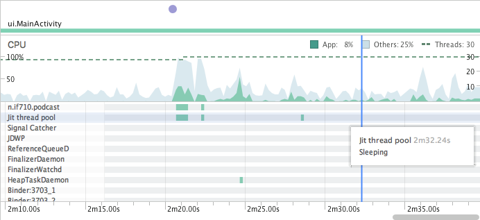
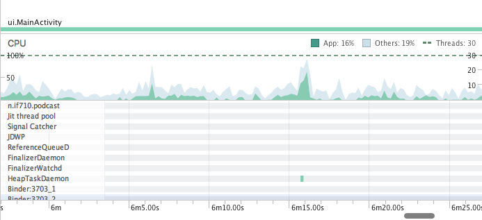
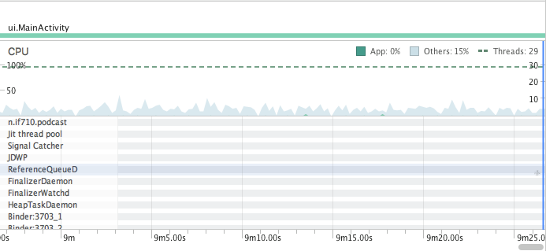

**Performance CPU**
==========

***Teste da CPU***
----------

Foi utilizada a ferramenta AndroidProfiler para realizar a avaliação do uso da CPU. Com a biblioteca AndroidDevMetrics não obtivemos sucesso devido a API necessária para rodar ser a 25 e nosso app utilizar a API 26. Dessa forma tentamos colocar o projeto para rodar na API 25 e isso acarretou em vários problemas e erros, o que impossibilitou o uso do AndroidDevMetrics. 

***AndroidProfiler:***
-------------

Foram feitos alguns testes diferentes ao logo da utilização do aplicativo. 

Os testes englobaram:

 - Aplicativo iniciado e sem interação 
 - Clique na tela
 - Download podcast
 - Scroll na aplicação 

Nessa situação, quando o aplicativo foi iniciado teve um aumento no nível de processamento da CPU. Após inicializado e sem interação com o app, o uso da CPU fica praticamente nulo.  

Nessa situação o download do podcast foi iniciado e ele ficou sendo baixado. Da pra notar na oscilação do uso da CPU enquanto o download não termina. 

Essa situação foi durante o download do podcast só pra mostrar o pico máximo alcançado.

Aqui mostra o uso nulo do processamento da CPU quando o download do podcast finaliza. 

Nessa situação fizemos alguns scroolings o que acarretou em um aumento do uso da CPU devido ao processo de carregar novos elementos para o usuário e fizemos alguns cliques na tela também o que ajudou também para a oscilação do uso da CPU.

