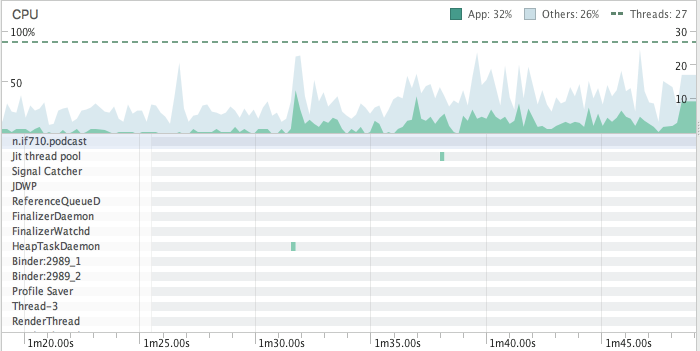
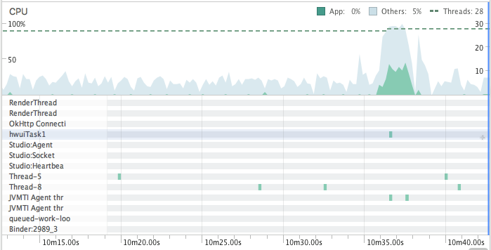

**Performance CPU**
==========

***Teste da CPU***
----------

Foi utilizada a ferramenta AndroidProfiler para realizar a avaliação do uso da CPU. Com a biblioteca AndroidDevMetrics não obtivemos sucesso devido a API necessária para rodar ser a 25 e nosso app utilizar a API 26. Dessa forma tentamos colocar o projeto para rodar na API 25 e isso acarretou em vários problemas e erros, o que impossibilitou o uso do AndroidDevMetrics. 

***AndroidProfiler:***
-------------

Foram feitos alguns testes diferentes ao logo da utilização do aplicativo. 

Os testes englobaram:

 - Podcast tocando
 - Clique na tela
 - Download podcast
 - Scroll na aplicação 

No início dessa situação não houve uma mudança grande no uso da CPU, e não se manteve tão uniforme. O que ocorreu no começo foi que colocamos o app para fazer download de um podcast. Após isso começamos a fazer vários cliques na tela e foi a partir disso que conseguimos ver o aumento no nível de processamento, oscilando bastante. Também fizemos um pequeno scrooling o que também contribuiu para esse aumento e consquente oscilação do uso da CPU. 

Nessa outra situação o que ocorreu foi que deixamos o podcast tocando e o uso da CPU foi basicamente nulo. O pico de processamento que se pode ver foi quando fizemos um scrooling acarretou em um aumento significativo do uso da CPU, devido ao processo de carregar vários novos elementos visualmente para o usuário. 

