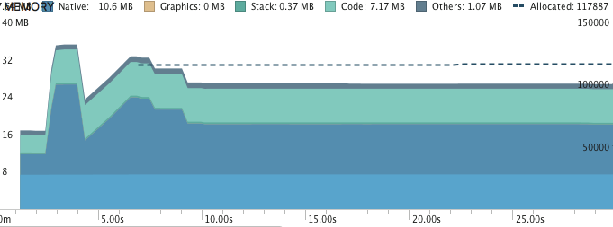
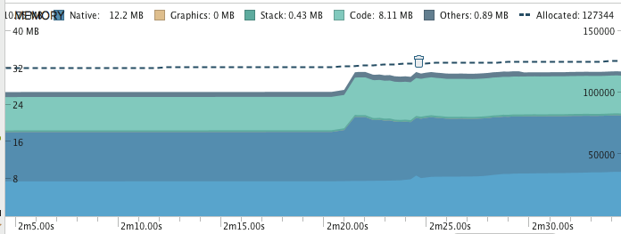
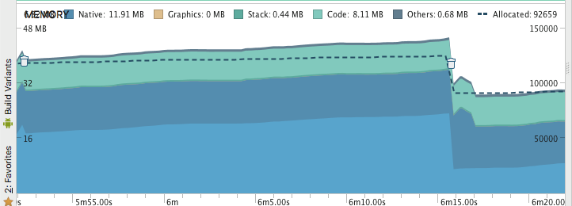
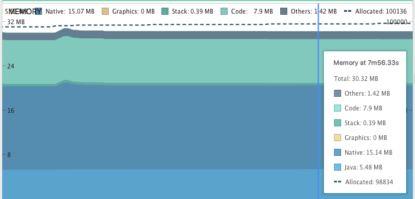

**Memória**
==========

***Testes de Memória***
-------------

Foram utilizadas as ferramentas AndroidProfiler e LeakCanary para avaliação dos testes de memória. 

***AndroidProfiler:***
-------------

Foram feito testes de memória relacionando o tempo de uso do app para ver se o consumo poderia aumentar ou se permaneceria quase da mesma forma. O emulador utilizado foi o Nexus5.

 1. O primeiro teste foi para mostrar o uso da memória quando o aplicativo é iniciado. ficou sendo utilizado por aproximadamente 26 segundos. Pode se ver um aumento do uso da memória e após o app ser iniciado ele fica constante. 
 
 
 
 2. O segundo teste de memória foi quando iniciamos o download do podcast. Teve uma leve oscilação, porém muito pequena e após o iniciado ele também fica constante.
 
 


Esse caso foi apenas para mostrar o pico máximo do uso da memória enquanto o download do podcast acontecia. Quando ele termina pode-se ver uma queda brusca do uso da memória, permanecendo constante depois, pois não houve nenhuma interação com o app. 



 3. O terceiro teste foi quando ocorreu cliques na tela, gerando um pequeno aumento no uso da memória. 



***LeakCanary:***
--------------------

Foram realizados testes englobando variadas situações para detecção de memory leak e não foi encontrado nenhum vazamento de memória utilizando a ferramenta LeakCanary.


***Boas Práticas Utilizadas***
-------------

Utilizamos ViewHolder pattern para reaproveitar as views criadas, e com isso não é necessário criar novas views durante o scroll.

```Java
    static class ViewHolder {
           TextView item_title;
           TextView item_date;
           Button button;
    }
```


```Java
 final  ViewHolder holder;
 final ItemFeed itemFeed = getItem(position);

 if (convertView == null) {
     convertView = View.inflate(getContext(), linkResource, null);
     holder = new ViewHolder();
     holder.item_title = (TextView) convertView.findViewById(R.id.item_title);
     holder.item_date = (TextView) convertView.findViewById(R.id.item_date);
     holder.button = (Button) convertView.findViewById(R.id.item_action);
     convertView.setTag(holder);
 } else {
     holder = (ViewHolder) convertView.getTag();
 }

 holder.item_title.setText(getItem(position).getTitle());
 holder.item_date.setText(getItem(position).getPubDate());
```


