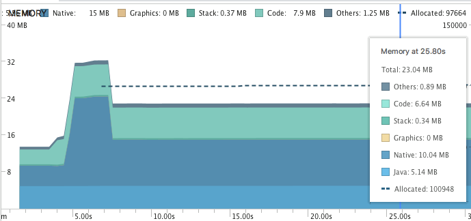

**Memória**
==========

***Testes de Memória***
----------

Foram utilizadas as ferramentas AndroidProfiler e LeakCanary para avaliação dos testes de memória. 

***AndroidProfiler:***
-------------

Foram feito dois testes de memória relacionando o tempo de uso do app para ver se o consumo poderia aumentar ou se permaneceria quase da mesma forma. O emulador utilizado foi o Nexus5.

 1. No primeiro teste o aplicativo ficou sendo utilizado por aproximadamente 26 segundos. A quantidade de memória utilizada apresentou algumas oscilações e o máximo de memória utilizada foi aproximadamente 32mb. O pico máximo atingido (32mb) ocorreu quando o aplicativo estava sendo executado em primeiro plano e com contante uso dele. Na imagem pode ser vista cada composição do app e sua respectiva fração no consumo da memória.  
 
 
 
 2. No segundo teste o aplicativo ficou sendo utilizado por aproximadamente 8 minutos. A quantidade de memória utilizada não apresentou quase nenhuma mudança quanto ao primeiro teste. O pico máximo de memória foi de aproximadamente 32 mb também.

	
***LeakCanary:***
--------------------

Não foi encontrado nenhum vazamento de memória utilizando a ferramenta LeakCanary.
