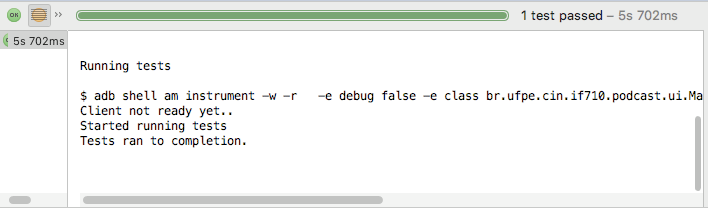
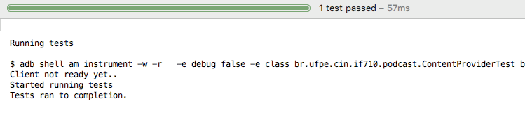

**Testes**
==========


**Testes de Interface:**
-------------

O teste de interface foi gerado através do espresso record. O teste é basicamente checar se a view exist, mudar para a página de descrição do ItemFeed selecionado, checar o título do texto e voltar.


O teste abaixo foi gerado pelo Espresso Test Recorder

```Java
@LargeTest
@RunWith(AndroidJUnit4.class)
public class MainActivityTest {

    @Rule
    public ActivityTestRule<MainActivity> mActivityTestRule = new ActivityTestRule<>(MainActivity.class);

    @Test
    public void mainActivityTest() {
        ViewInteraction linearLayout = onView(
                allOf(childAtPosition(
                        allOf(withId(R.id.items),
                                childAtPosition(
                                        IsInstanceOf.<View>instanceOf(android.widget.LinearLayout.class),
                                        0)),
                        0),
                        isDisplayed()));
        linearLayout.check(matches(isDisplayed()));

        DataInteraction linearLayout2 = onData(anything())
                .inAdapterView(allOf(withId(R.id.items),
                        childAtPosition(
                                withClassName(is("android.widget.LinearLayout")),
                                0)))
                .atPosition(0);
        linearLayout2.perform(click());

        ViewInteraction textView = onView(
                allOf(withId(R.id.text_title), withText("Ciência e Pseudociência"),
                        childAtPosition(
                                childAtPosition(
                                        IsInstanceOf.<View>instanceOf(android.view.ViewGroup.class),
                                        0),
                                0),
                        isDisplayed()));
        textView.check(matches(withText("Ciência e Pseudociência")));

        pressBack();

    }
```

```Java
private static Matcher<View> childAtPosition(
            final Matcher<View> parentMatcher, final int position) {

        return new TypeSafeMatcher<View>() {
            @Override
            public void describeTo(Description description) {
                description.appendText("Child at position " + position + " in parent ");
                parentMatcher.describeTo(description);
            }

            @Override
            public boolean matchesSafely(View view) {
                ViewParent parent = view.getParent();
                return parent instanceof ViewGroup && parentMatcher.matches(parent)
                        && view.equals(((ViewGroup) parent).getChildAt(position));
            }
        };
    }

```
Resultado do teste:




	
**Testes de Integração:**
--------------------


No teste de integração, utilizamos o ProviderTestCase2 para isolar o banco de dados do sistema, porém, ele ainda permite operação no banco. Foi realizado o teste de insert no banco.


```Java
	@RunWith(AndroidJUnit4.class)
	public class ContentProviderTest extends ProviderTestCase2<PodcastProvider>{

	    MockContentResolver mockContentResolver;

	    public ContentProviderTest(){
	        super(PodcastProvider.class, PodcastProviderContract.AUTHORITY);
	    }


	    @Before
	    @Override
	    public void setUp() throws Exception {
	        //setContext(InstrumentationRegistry.getTargetContext());
	        super.setUp();


	    }


	    @After
	    @Override
	    public void tearDown() throws  Exception{
	        super.tearDown();
	    }


	    @Test
	    public void insertItemFeedTest(){


	        ContentValues cv = new ContentValues();
	        cv.put(PodcastProviderContract.EPISODE_TITLE, "Tanto Faz");
	        cv.put(PodcastProviderContract.EPISODE_DATE, "01/10/1010");
	        cv.put(PodcastProviderContract.EPISODE_DESC, "sem ideia");
	        cv.put(PodcastProviderContract.EPISODE_DOWNLOAD_LINK, "youtubiu.com");
	        cv.put(PodcastProviderContract.EPISODE_LINK, "faltando");
	        cv.put(PodcastProviderContract.EPISODE_FILE_URI, "123451000");
	        cv.put(PodcastProviderContract.EPISODE_STATE, "0");
	        cv.put(PodcastProviderContract.EPISODE_TIME, String.valueOf(1000));


	        Uri uri = getMockContentResolver().insert(PodcastProviderContract.EPISODE_LIST_URI, cv);


	        assertNotNull(uri);
	    }

	}
	
```




